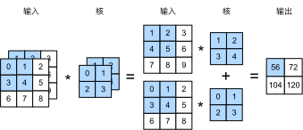

彩色图片除了有高和宽两个维度外还有 RGB 三个颜色通道。那么可以表示为一个 3 * h * w 的多维数组。我们将大小为 3 的这一维称为通道维。

### 多输入通道

当输入数据含多个通道时，我们需要构造一个输入通道数与输入数据的通道数相同的卷积核，从而能够与含多通道的输入数据做互相关运算。



```python
import torch
from torch import nn
import sys
sys.path.append("..") 
import d2lzh_pytorch as d2l

def corr2d_multi_in(X, K):
    # 沿着X和K的第0维（通道维）分别计算再相加
    res = d2l.corr2d(X[0, :, :], K[0, :, :])
    for i in range(1, X.shape[0]):
        res += d2l.corr2d(X[i, :, :], K[i, :, :])
    return res

X = torch.tensor([[[0, 1, 2], [3, 4, 5], [6, 7, 8]],
              [[1, 2, 3], [4, 5, 6], [7, 8, 9]]])
K = torch.tensor([[[0, 1], [2, 3]], [[1, 2], [3, 4]]])

corr2d_multi_in(X, K)
```

### 多输出通道

当输入通道有多个时，因为我们对各个通道的结果做了累加，所以不论输入通道数是多少，输出通道数总是为1。

如果希望得到含多个通道的输出，我们可以为每个输出通道分别创建形状为的核数组，将它们在输出通道维上连结。

```python
def corr2d_multi_in_out(X, K):
    # 对K的第0维遍历，每次同输入X做互相关计算。所有结果使用stack函数合并在一起
    return torch.stack([corr2d_multi_in(X, k) for k in K])
```

我们将核数组`K`同`K+1`（`K`中每个元素加一）和`K+2`连结在一起来构造一个输出通道数为3的卷积核。

```python
K = torch.stack([K, K + 1, K + 2])
K.shape # torch.Size([3, 2, 2, 2])
```

###  1 * 1 卷积层

输入和输出具有相同的高和宽。输出中的每个元素来自输入中在高和宽上相同位置的元素在不同通道之间的按权重累加。假设我们将通道维当作特征维，将高和宽维度上的元素当成数据样本，**那么 1 * 1 卷积层的作用与全连接层等价**。


### 小结

- 使用多通道可以拓展卷积层的模型参数。
- 假设将通道维当作特征维，将高和宽维度上的元素当成数据样本，那么1×1卷积层的作用与全连接层等价。
- 1×1卷积层通常用来调整网络层之间的通道数，并控制模型复杂度。
